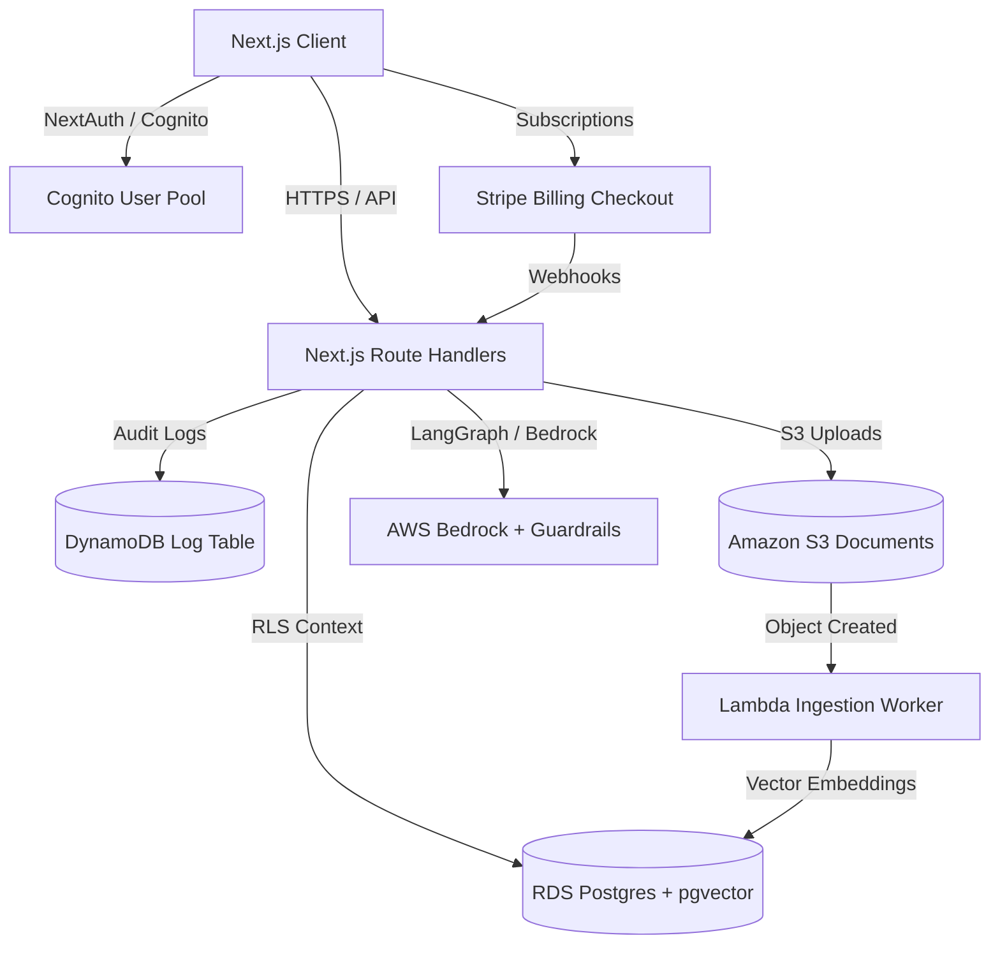

# Implementation Plan - Production SaaS Transition (Rayn)

This plan outlines the architecture, integrations, and file updates required to transition the `Rayn` prototype into a live, production-grade, multi-tenant enterprise legal SaaS platform using real AWS services and production patterns.

---

## User Review Required

> [!WARNING]
> **AWS Account and Limits:** Transitioning to production requires an AWS account with access to Bedrock (Claude 3.5 Sonnet / Titan Embeddings enabled). Please ensure you have requested model access in your AWS Console prior to deployment.

> [!IMPORTANT]
> **Database Isolation Model:** We propose using a **Logical Partitioning Model** (Single database, separate PostgreSQL schemas with Row-Level Security policies). This balances cost-efficiency with high-grade security, ensuring complete firm data isolation.

---

## Proposed Production Architecture



---

## Proposed Changes

### Component 1: Authentication & Identity Management
Integrate NextAuth.js on the Next.js server to handle authentication handshakes with AWS Cognito.

#### [NEW] [route.ts](file:///d:/PROJECTS/Rayn/Rayn-Web/app/api/auth/%5B...nextauth%5D/route.ts)
- Configure `CognitoProvider` with client ID, user pool ID, and client secret.
- In the `jwt` callback, map Cognito User Groups (e.g., `SuperAdmin`, `Partner`) to the internal `Role` definitions.
- Set up a session callback to expose the `tenant_id` and role to the client.

#### [MODIFY] [auth-context.tsx](file:///d:/PROJECTS/Rayn/Rayn-Web/lib/auth-context.tsx)
- Rebuild the hook to consume sessions from NextAuth (`useSession`) instead of using `localStorage`.

---

### Component 2: Multi-Tenant Database (PostgreSQL + RLS)
Migrate the simulation database structure to an Amazon RDS PostgreSQL instance using Prisma ORM.

#### [NEW] [schema.prisma](file:///d:/PROJECTS/Rayn/Rayn-Web/prisma/schema.prisma)
- Define schemas for `Tenant`, `User`, `Case`, `AuditEvent`, and `Document`.
- Add a `tenantId` field to all client entities (e.g., cases, clients, documents).

#### [NEW] [rls.sql](file:///d:/PROJECTS/Rayn/Rayn-Web/prisma/migrations/rls.sql)
- Write raw SQL migrations to enable PostgreSQL Row-Level Security (RLS) on `Case` and `Document` tables.
- Create policies using `current_setting('app.current_tenant_id')` to enforce data isolation dynamically:
  ```sql
  CREATE POLICY tenant_isolation_policy ON "Case" 
  USING (tenant_id = current_setting('app.current_tenant_id', true));
  ```

---

### Component 3: Document Ingestion Pipeline
Build a secure, stateless document upload and indexing system using Amazon S3 and AWS Lambda.

#### [NEW] [route.ts](file:///d:/PROJECTS/Rayn/Rayn-Web/app/api/documents/upload-url/route.ts)
- Create a Next.js route that generates S3 pre-signed URLs using the AWS SDK `@aws-sdk/client-s3`.
- Set metadata tags on the S3 upload request mapping the document to the corresponding `tenant_id`.

#### [NEW] [handler.ts](file:///d:/PROJECTS/Rayn/Rayn-Web/services/lambda-ingestion/handler.ts)
- An AWS Lambda function triggered by `s3:ObjectCreated` events.
- Extracts text content (using text extraction tools or AWS Textract).
- Chunks texts and calculates vector embeddings using **Amazon Bedrock (Titan Text Embeddings)**.
- Saves the document chunks and vector representations into the RDS `pgvector` database.

---

### Component 4: Agentic AI Orchestrator (LangGraph)
Create a Next.js API route that handles LangGraph agent coordination and tools execution.

#### [NEW] [route.ts](file:///d:/PROJECTS/Rayn/Rayn-Web/app/api/agent/run/route.ts)
- Build the ReAct logic graph using **LangGraph** (TypeScript/Python integration).
- Define tools:
  - **S3VectorSearch:** Queries `pgvector` matching the active tenant and case parameters.
  - **PrecedentFinder:** Runs similarity queries against jurisdictional case files.
  - **DocketLookup:** Calls judicial docket scraping APIs.
- Initialize the graph state with a token budget check derived from the `tenant.aiContextLimit`.

#### [NEW] [guardrails.ts](file:///d:/PROJECTS/Rayn/Rayn-Web/lib/ai/guardrails.ts)
- Prompt sanitation filters using **Microsoft Presidio** for PII redaction.
- Integrates with **Amazon Bedrock Guardrails** to filter prompt injections.

---

### Component 5: Audit Log Persistence (DynamoDB)
Migrate the simulation event logger to write directly to DynamoDB tables.

#### [MODIFY] [audit-logger.ts](file:///d:/PROJECTS/Rayn/Rayn-Web/lib/audit-logger.ts)
- Rewrite the `log` function to execute a POST request to `/api/audit/log`.

#### [NEW] [route.ts](file:///d:/PROJECTS/Rayn/Rayn-Web/app/api/audit/log/route.ts)
- A Next.js API handler that processes audit logs and writes them to **Amazon DynamoDB** using `@aws-sdk/client-dynamodb`.
- Enforces partitioning keys on `tenantId` and sort keys on `timestamp` for fast, compliant retrieval.

---

### Component 6: Subscription Payments (Stripe)
Implement billing synchronization.

#### [NEW] [route.ts](file:///d:/PROJECTS/Rayn/Rayn-Web/app/api/billing/webhook/route.ts)
- A Next.js route handling Stripe webhooks.
- Listens for `customer.subscription.updated` and `checkout.session.completed` events.
- Automatically increments `seatsTotal` and adjusts the active plan (Professional/Enterprise) and context limit parameter in the `Tenant` table when payment goes through.

---

## Verification Plan

### Automated Verification
1. Run local linting and type validations:
   ```bash
   npm run lint
   npm run build
   ```
2. Verify NextAuth.js handshake routes using Mock OAuth providers.
3. Test DB Row-Level Security using unit test scripts targeting cross-tenant queries.

### Manual Verification
1. Log in as an administrator on the portal; verify Cognito MFA redirects to the authenticator code screen.
2. Upload a PDF file, verify S3 receives the document and the Lambda function triggers embedding generation.
3. Run the LangGraph agent in the Strategy Room and inspect the final token budget update inside the Billing dashboard.
